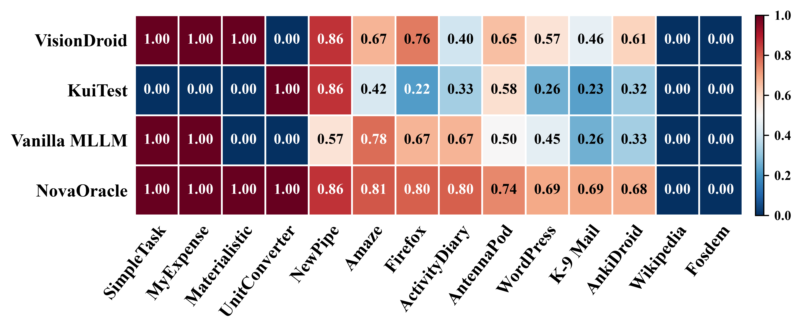
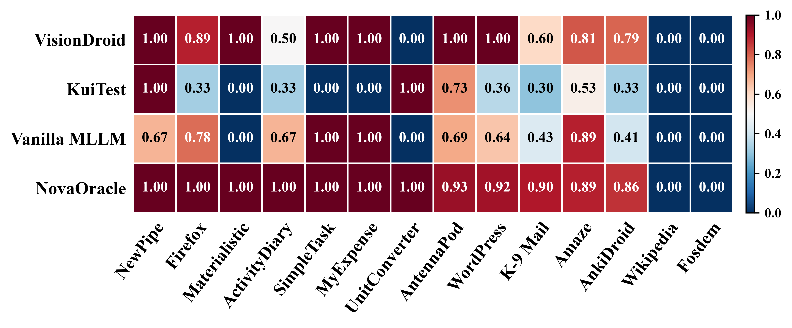
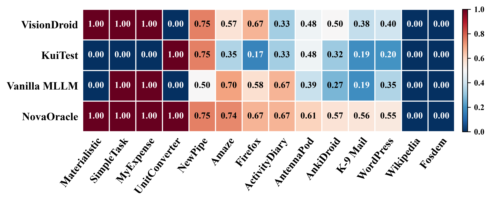

# 📌 Table of Contents
- [General Introduction](#-general-introduction)
- [Repository Structure](#-repository-structure)
- [Requirements](#-requirements)
- [Usage](#-usage)
- [Experimental Results](#-experimental-results)

# 📖 General Introduction
This repository contains the complete replication package for the ICSE 2027 submission. It includes the experimental datasets, source code, prompt templates, and evaluation results that are requested by the replication.

# 📁 Repository Structure
```
.
├── data_process - Scripts for executing test cases on the emulator and generating annotated screenshots and data.
├── datasets - The benchmark datasets, interaction sequences, GUI screenshots, and view hierarchies.
├── prompts - Prompt templates used to state inference and bug detection.
├── results - Evaluation results of NovaOracle and the baseline approaches.
├── tools - The source code of NovaOracle and the baseline approaches, along with the conda environment.
└── README.md
```
All the Apk files and issue links for reproducible bugs :   
https://drive.google.com/drive/folders/1Fk1qGt4JJxrOopwj4o8ovZoWC-N0dvYx?usp=drive_link  

# 🛠 Requirements

- Python == 3.13.5
- pandas == 2.3.1
- Pillow == 11.3.0
- requests == 2.32.4
- openai == 2.41.0
- opencv-python == 4.11.0.86

​	You can setup the requirements via the conda environment:

​	`conda env create -f novaoracle.yaml`

# 🚀 Usage

### 1. Setup
Clone replicate package to your local file system

### 2. Dataset Download
We have uploaded all the GUI screenshots and other data required for running the evaluated tools to Google Drive.  
https://drive.google.com/drive/folders/1KauX-BRS8jJY5bPF1-U3dojVzcIdvGIG?usp=drive_link  
Before execution, download the dataset, extract it, and place it in the repository root as `datasets/`.

#### Example:
To run the Odin dataset on NovaOracle:
1. Download Odin.zip from the provided link.
2. Extract the archive to the NovaOracle/datasets/.

#### Expected layout:

```text
datasets
├── Odin
|   ├── action_description_data
|   ├── hierarchy_files
|   ├── images
|   ├── page_description_data
|   ├── struct_case_data
|   └── test_case
└── ...
```

### 3. Run Tools
#### Configuration:

Before running a tool, edit the corresponding `config.ini` file under `tools/<ToolName>/`.

Example for `tools/NovaOracle/config.ini`:

```ini
[S]
api_key = YOUR_API_KEY
model_name = YOUR_MULTIMODAL_MODEL
url = https://your-openai-compatible-endpoint/v1/chat/completions
data_path = .\NovaOracle\datasets
bug_path = bug
state_path = state_changes
xml_diff_path = xml_diffs
```

#### Run each tool from the repository root:

- NovaOracle: `python tools/NovaOracle/run.py`
- VisionDroid: `python tools/VisionDroid/run.py`
- VanillaMLLM:  `python tools/VanillaMLLM/run.py`
- KuiTest: `python tools/KuiTest/run.py`

#### The tool scripts produce:

- `bug/`: predicted bug reports for buggy test cases.
- `bugfree/`: predicted reports for no-bug test cases, when a no-bug dataset is used.
- `token_usage.txt`, `token_in_usage.txt`, `token_out_usage.txt`: token statistics.
- `times_records.txt`: per-test execution time.

# 📊 Experimental Results

We provide application-level performance comparisons across 14 applications using three heatmaps: precision, recall, and F1-score. Each heatmap reports the performance of **NovaOracle** and the baseline approaches on individual applications, providing a detailed view of their effectiveness across different application scenarios. Higher values indicate better performance.

1. F1-score of **NovaOracle** and the Baselines per Application:



2. Precision of **NovaOracle** and the Baselines per Application:



3. Recall of **NovaOracle** and the Baselines per Application:

